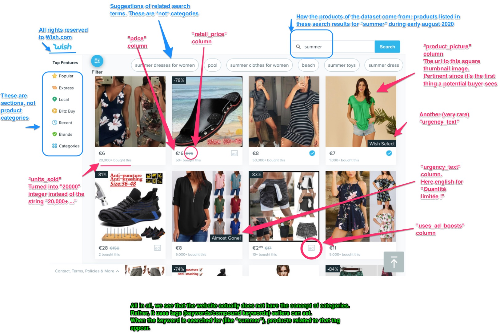

# Módulo 3: Procesamiento de datos con Python

## 1: Planteamiento del problema 

### - Definir conjunto de datos a trabajar: 

### Descripción
Realizar tareas de limpieza, manipulación y análisis de bases de datos utilizando el lenguaje de programación Python, para después poder crear visualizaciones, predicciones y modelaje matemático, que permitirán transformar datos en información para mejorar la toma decisiones en las organizaciones.
  
### Descripción del proyecto

**Contexto**  

>Estudiar los mejores productos requiere más que solo listados de productos. También necesita saber qué se vende bien y qué no.

**Contenido**

>Este conjunto de datos contiene listados de productos, así como calificaciones de productos y rendimiento de ventas, que no encontrará en otros conjuntos de datos.
>Con esto, finalmente puede comenzar a buscar correlaciones y patrones con respecto al éxito de un producto y los diversos componentes.
>https://www.kaggle.com/datasets/jmmvutu/summer-products-and-sales-in-ecommerce-wish
- [CSV](../DS/productos-verano-calificación-rendimiento_2020-08.csv) 

**Inspiración**

>¿Qué tal tratar de validar la idea establecida de la sensibilidad humana a las caídas de precios? (precio con descuento en comparación con el precio minorista original)
>Puede buscar las principales categorías de productos para saber qué se vende mejor.
>¿Los productos malos venden? ¿Qué hay de la relación entre la calidad de un producto (valoraciones) y su éxito? ¿El precio influye en esto?

**Metodología de recolección**
  
>Los datos provienen de la plataforma Wish.
Básicamente, los productos enumerados en el conjunto de datos son los que aparecerían si escribe "verano" en el campo de búsqueda de la plataforma.

>Puede navegar por el sitio web o la aplicación de Wish para tener una idea del tipo de información que puede obtener de allí y cómo se presenta. Esto podría darle algunas ideas y una mejor comprensión.

>Los datos se extrajeron con francés como configuración (de ahí la presencia de algunos caracteres latinos no ascii como «é» y «à») en la columna del título.

**Características y columnas**
>Los datos se extrajeron en la localización francesa (por lo tanto, algunos caracteres latinos no ascii como «é» y «à») en la columna del título.

>El title_orig, por otro lado, contiene el título original (el título base) que se muestra de forma predeterminada. Cuando el vendedor proporciona una traducción, aparece en la columna del título. Cuando las columnas title y title_orig son iguales, generalmente significa que el vendedor no especificó una traducción que se mostraría a los usuarios con la configuración en francés.

>Una imagen vale mas que mil palabras. En la siguiente captura de pantalla, puede ver algunas características y cómo interpretarlas.
  
  
  

### Contenido