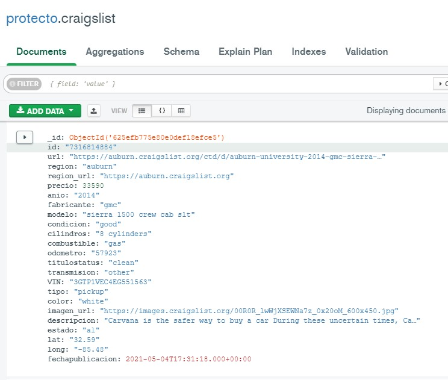
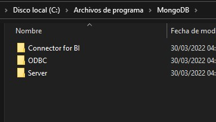
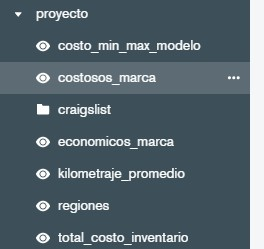

# Introducción a Bases de Datos

## 1: Planteamiento del problema 

### - Definir conjunto de datos a trabajar: 
**Contexto**
>Craigslist es la colección de vehículos usados en venta más grande del mundo, este conjunto de datos que incluye todas las entradas de vehículos usados dentro de los Estados Unidos en Craigslist.
>
**Contenido**
>Estos datos se extraen cada pocos meses, contienen la mayoría de la información relevante que proporciona Craigslist sobre las ventas de automóviles, incluidas columnas como precio, estado, fabricante, latitud/longitud y otras 18 categorías.
https://www.kaggle.com/datasets/austinreese/craigslist-carstrucks-data

### - Dar forma a la base de datos y obtener información relevante.
>
   
### - Definir la forma de uso de los datos y problemas a resolver. 
>- Forma de uso base de datos no relacional basada en documentos, analisis de informacion, ventas precios, region, etc.

### - Plantear diagrama de base de datos a utilizar (generarlo en MySQL Workbench).
> No aplica
### - Definir cinco preguntas sobre la base de datos.
>- Todos los automóviles de un fabricante en especifico `FILTER: {fabricante: /chevrolet/i}` 
>- Obtener los 100 autos mas costosos `[{
    $sort: {
        precio: -1
    }
}, {
    $limit: 100
}]` 
>- Obtener los 100 autos mas economicos   `[{
    $sort: {
        precio: 1
    }
}, {
    $limit: 100
}]` 
>- Obtener los 100 autos mas costosos por marca `[{
    $sort: {
        precio: -1
    }
}, {
    $match: {
        fabricante: RegExp('chevrolet', i)
    }
}, {
    $limit: 100
}]` 
>-  Obtener los 100 autos mas economicos por marca `[{
    $sort: {
        precio: -1
    }
}, {
    $match: {
        fabricante: RegExp('chevrolet', i)
    }
}, {
    $limit: 100
}]` 
---
   
 ## 2: Planteamiento del problema 
 ### - Añadir al menos otras cinco preguntas sobre la base de datos definida que apliquen los conceptos vistos durante la sesión (incluir el uso de: reconocimiento de patrones, funciones de agrupamiento, agrupamientos y subconsultas). 
  >- Obtener los diferentes precios de un modelo en especifico `FILTER {modelo:"c-hr xle sport utility 4d"} PROJECT {precio:1,modelo:1}` 
  >- Obtener el maximo y minimo de precios de los diferentes modelos  `[{
    $group: {
        _id: '$modelo',
        maxdist: {
            $max: '$precio'
        },
        mindist: {
            $min: '$precio'
        }
    }
}]` 
 >- Precio total de inventario por fabricante `[{
    $group: {
        _id: '$fabricante',
        precioTotal: {
            $sum: '$precio'
        }
    }
}]` 
 >- Obtener todas las regiones en donde se cuenta con sucursal `[{
    $unwind: {
        path: '$region',
        includeArrayIndex: 'string',
        preserveNullAndEmptyArrays: false
    }
}, {
    $group: {
        _id: null,
        regiones: {
            $addToSet: '$region'
        }
    }
}]` 
 >- Kilometraje promedio por modelo `[{
    $group: {
        _id: '$modelo',
        media: {
            $avg: '$odometro'
        }
    }
}]` 
   
   
 ## 3: Planteamiento del problema 
 ### -Añadir al menos otras cinco preguntas a realizar a la base de datos.
 >- Buscar modelos iguales o superiores del anio 2000, ordenando del mas reciente `FILTER {anio:{$gte:2000}} SORT {anio:-1}` 
 >- Buscar modelos combustible igual a gas y transmision automatica `FILTER {combustible:"gas",transmision:"automatic"} SORT {odometro:-1}`
 >- Buscar modelos entre el anio 200 y 2010, ordenando del mas reciente `FILTER {$and: [{anio: {$gte: 2000}},{anio: {$lte: 2010}}]} SORT {anio:-1}` 
   
 ### -Incluir el uso de: llaves primarias, tipos de relaciones, relación de tablas mediante joins y creación de vistas.
 ### -Crear al menos 5 vistas de preguntas más complejas (escribir en SQL para probarlas más adelante).
   
 ## 4: Instalación de la base de datos
 ### -Instalar el sistema gestor de bases de datos en un equipo (o en la nube en caso de MongoDB).
   >
 ### -Crear las tablas o colecciones necesarias para el proyecto.
   >
 ### -Ejecutar las consultas realizadas a lo largo de todos los postworks del módulo en el caso de MySQL. En caso de MongoDB, realizar en las siguientes sesiones.
 ### -Guardar las consultas más relevantes como vistas. 
   >
   
 ## 5: Planteamiento del problema 
 ### -Usar como base las preguntas definidas en el Postwork de la Sesión 1, reescribir las consultas usando JSON.
 ### -Ejecutar usando MongoDB Compass. En cada caso, si el JSON corresponde a una proyección, filtro, ordenamiento o límite de resultados.
## 6: Planteamiento del problema 
### -Usar como base las preguntas definidas en el Postwork de la Sesión 2, reescribir las consultas usando JSON.
### -Probar las consultas especificando en cada caso, si corresponde a una proyección, filtro, ordenamiento, límite de resultados o a una agregación.
## 7: Planteamiento del problema 
### -Usar como base las preguntas definidas en el Postwork de la Sesión 3, reescribir las consultas usando JSON.
### -Probar en la instancia de MongoDB, recuerda especificar en cada caso, si el JSON corresponde a una proyección, filtro, ordenamiento, límite de resultados o a una agregación.
## 8: Revisión final 
### -Revisar todos los retos del módulo, terminar todos los retos faltantes.
### -Usar el círculo de estudio para plantear dudas. 
### -Llenar la plantilla para identificar el problema a resolver, analizar cómo resolver.

   >-  `` 
 
   
   
   
   
